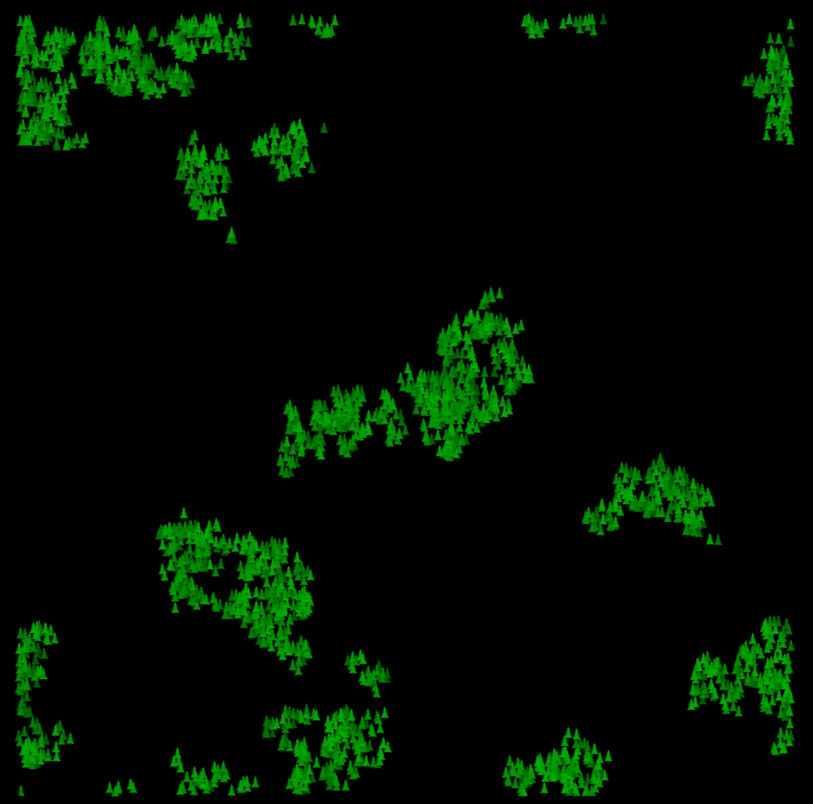

# Real-time Data-Oriented Virtual Forestry Simulation for Games
*Benjamin Williams[^1], Thomas Oliver[^1], Davin Ward[^1] & Christopher Headleand[^1]*

*A paper accepted to [CGVC 2024](https://cgvc.org.uk/CGVC2024/)*

<p>
    
    
    
</p>

[^1]: Staffordshire University Games Institute; School of Digital, Technologies, Innovation and Business; Staffordshire University, UK.

### Trailer
repo-assets/cgvc-trailer.mp4

## This repository
This repository serves as an open-source solution to our recently published optimisation strategy for the real-time simulation of virtual forestry. In our approach, we leverage the power of data-orientation, spatial partitioning, multithreaded parallelisation and native IL compilation to achieve a 45x speedup against serial implementations. We utilise Unity's Entity-Component System to enable a high degree of optimisation for real-time forest simulation. 

Our approach offers a unique method upon which the growth of virtual forestry can be simulated in real-time, using the cutting edge bio-inspired plant competition algorithms; a previously unachievable goal. 

By making this project public, we strongly encourage future work and collaboration in leveraging the power of Unity's ECS to massively optimise entity-oriented algorithms. Please reach out to us if you are interested in working together.

### Getting started
To get started with the project, make sure you have *Unity 2022.3.4f1* or later installed. Then, download or clone the repository with:

```sh
# Clone the repo
git clone https://github.com/StaffsUniGames/pcg-forests-ecs.git
```

From here, open up the project and open the main scene with *File > Open Scene > Assets/ecs/scenes/main.unity*. Following this, try to play the project by using the *Play* button. If nothing happens, you may need to enable the sub-scene in the hierarchy. More information is detailed on this [here](https://docs.unity3d.com/Packages/com.unity.entities@1.0/manual/conversion-subscenes.html).

## Paper details
As mentioned at the start of this document, this repository is an open-source project outlined in a paper submitted to CGVC2024. Currently, the paper is undergoing minor revisions. The details below will be updated in due course.

| Category | Detail |
|----------|-------|
| Title | Real-time Data-Oriented Virtual Forestry Simulation for Games
| Authors | B. Williams, T. Oliver, D. Ward & C. Headleand
| Publication Year | 2024
| Venue | [The 42nd Computer Graphics & Visual Computing Conference](https://cgvc.org.uk/CGVC2024/) (CGVC'24)
| Paper link | **Still in press**
| DOI | **Still in press**


## Media
Below is a list of media showcasing our strategy.

<details>
<summary>3D visualisation of example forest</summary>


</details>

<details>
<summary>Growth of forest with high spread distance</summary>


</details>


<details>
<summary>Growth of forest with low spread distance</summary>


</details>


<details>
<summary>Emergent seasonal growth with low spread probability</summary>





</details>

## License
The source code within this repository is released under the [MIT License](LICENSE).